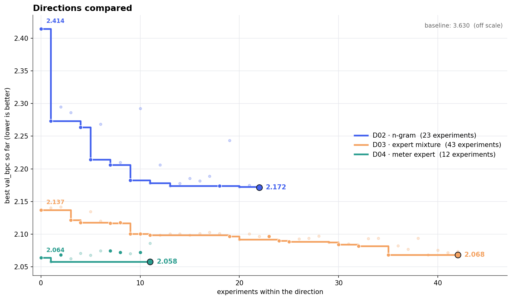

# ambidex



*A run on Tiny Shakespeare. Each line is one research direction the agent found while exploring and then pushed in exploitation.*

This is my first public repo and my first README 🎉

ambidex is an autoresearch harness. The agent works in two modes: it pushes ideas that already work further (exploitation), and it looks for new ones (exploration). It extends Karpathy's [autoresearch](https://github.com/karpathy/autoresearch), which only covers the first.

## The name

ambidex is short for ambidexterity, which comes from Latin: *ambi* means both, *dexter* means right hand. It originally described people who can use both hands equally well, without a dominant side.

Organizational researchers later borrowed the word for companies. An ambidextrous company does two things at once that pull in opposite directions. It exploits what it already has, making the existing business better and cheaper. And it explores what it doesn't have yet: new products, new markets, things that might fail.

## Ok, but why should I care?

I think the same split exists in science.

Exploitation is gap-filling, hill climbing, the scaling-law way of working. You take an approach and push it until you see what it can do. This work is valuable, and it is the only way to find out what an idea is worth. It needs a mindset that watches metrics and performance closely.

Exploration is open-ended research: trying new concepts, borrowing from other fields, thinking about a problem from scratch. It needs a different mindset. If you only follow the metric, the best next step is almost always a variation of what you already have, because most new ideas lose to a well-tuned baseline at first. It needs a lot more scientific judgment and intuition, and a willingness to run experiments that will probably fail.

autoresearch (which I'm a big fan of) is built for exploitation. The agent edits one training script, trains for five minutes, and keeps the change only if the metric beats the best run so far. That gives you a fast, quantitative feedback loop and a system that is easy to control. What it rarely gives you is a new approach, because keep/discard rewards small improvements to whatever is already there.

There is a second reason agents struggle with exploration. Coding agents are trained and prompted to fix things: find the bug, make the test pass, try again. That makes them focused and reactive, which works well for exploitation. Exploration needs the opposite: stepping back, questioning the setup and following a hunch. So ambidex doesn't try to build a model that is especially good at exploring. It brings exploration into the metric-driven logic of autoresearch as a second way of working, and lets the agent switch between the two.

## How it works

Organizational research distinguishes three kinds of ambidexterity. In the structural kind, separate units do separate jobs: an R&D lab explores while the factory exploits. In the temporal kind, the whole organization alternates between phases. In the contextual kind, the same people switch between modes depending on the situation. ambidex uses the contextual version. There is just one agent, and it decides by itself when to explore and when to exploit.

The system is three files:

- `program.md` is the base prompt. It explains the research goal, what the two modes are for and how they feed each other, and everything that holds in both modes: constraints, git, logging, the logbook.
- `explore.md` is the exploration mode. The agent collects possible directions and tests them in *ventures*, small scripts in `ventures/` with one row each in `ventures.tsv` that records what happened, not what it means. Every so often it puts its current idea on the real test bench, in what the files call the *Schaltraum* (German for switch room; the term comes from a model of organizational ambidexterity in which exploring teams regularly go there to turn loose ideas into something standardized). When the agent thinks a direction is ready, that run becomes a *viable proof* and is handed off.
- `exploit.md` is the exploitation mode, and it is basically autoresearch: one file, one metric, keep or discard, on its own git branch for each direction. When the direction stops paying off, or raises a question worth investigating, the agent goes back to exploring.

Both modes share `logbook.md`, a short record of which directions were tried, where the evidence is, and what state each one is in. The agent reads it every time it switches modes, so it is written like a ship's log: facts and pointers to evidence, no opinions. Or, as the file puts it, "an entry describes yesterday's weather, it does not determine tomorrow's." The reason is path dependence. An agent that reads its own earlier conclusions tends to treat them as settled and digs deeper into the same idea, a kind of epistemic lock-in.

## Design choices

- The agent decides when to explore, when to exploit and when to hand off. There are no quotas, budgets or switching rules. The prompts give principles and heuristics instead of a procedure, following one idea I kept coming back to while writing them: give the agent enough structure to develop good judgment, but enough autonomy to actually exercise it.
- A viable proof doesn't have to beat the current best run. New ideas usually start out worse than a baseline that has already been optimized for hours, so the only requirements are that it runs and that the agent considers it promising. Finding out how good it can get is the job of exploitation.
- When the agent switches back into exploration, it starts from scratch: it sets aside the direction it just worked on and begins again from the problem itself. The earlier direction stays in the logbook, but it isn't where the next idea has to start.
- The simplicity criterion from autoresearch applies in both modes: if two solutions work equally well, the simpler one wins. I tried to follow that for the prompts as well.
- The files are task-agnostic. Everything specific to a problem (experiment file, metric, time budget, run command) sits in one parameter table at the top of `program.md`.

## Cool, how do I run it?

ambidex works on any task that has a fixed evaluation and an experiment file the agent can change. The repo comes with one example, Tiny Shakespeare: character-level language modeling with a 60-second CPU training budget per run. I picked it because my Windows laptop can't run nanochat and renting an H100 wasn't in the budget. How to swap in your own task is described further down.

You need [uv](https://docs.astral.sh/uv/) (it installs Python for you if needed), git and a coding agent (I use Claude Code). On Windows, run `./new_run.sh` in Git Bash; the `uv` commands work in any shell.

```bash
# 1. get the template
git clone https://github.com/Tim-Projekt/ambidex.git
cd ambidex

# 2. create a run repo next to the template, from the example setup
#    (this also fills in the parameters for the task; on Windows, git may print a
#    harmless "LF will be replaced by CRLF" warning)
./new_run.sh setups/shakespeare ../ambidex-shakespeare
cd ../ambidex-shakespeare

# 3. install dependencies (the first time downloads a CPU build of PyTorch, about a minute)
#    and the data (~1 MB, saved to ~/.cache/ambidex-shakespeare/)
uv sync
uv run prepare.py

# 4. optional sanity check: one baseline run
uv run train.py
```

Budget about two and a half minutes for one run: 60 seconds of training plus startup and evaluation. The baseline should end with a `val_bpc:` line somewhere around 3.6 to 3.7.

Then open your agent in the run repo and prompt:

```
Read program.md and let's set up a new run.
```

For a run overnight the agent must not wait for approvals, so it needs to run without permission prompts (in Claude Code, `--dangerously-skip-permissions`). Only do that in a folder you can throw away, since the agent can then run any command without asking.

The agent picks a run tag, creates the branch, the ledgers and the logbook, and asks you to confirm. Don't just reply "go ahead". In my runs the agent took that as "run the baseline, try one idea, report back" and stopped after the first venture. I send this instead:

```
Go. From now on run the research loop from program.md indefinitely. I'm away and will interrupt you myself. Don't report back to me: every message you write comes with the next action.
```

While it runs, `logbook.md` shows where the research stands. `uv run analysis.py` plots all experiments to `progress.png`, and `uv run plot_directions.py` draws the chart at the top of this page to `plots/directions.png`.

## Using your own task

A task is a folder in `setups/`. It needs four things:

- `prepare.py`: the fixed part. It loads or downloads the data and contains the evaluation. The agent may read it but never change it, so this is where the ground truth lives.
- `train.py` (or whatever you call it): the experiment file. It holds a simple baseline, runs within a fixed time budget and ends by printing a summary block with lines like `metric_name: value`, so the agent can grep the result.
- `pyproject.toml`: the dependencies. The agent can't install new packages, so include everything it might reasonably need.
- `params.md`: the parameter table (experiment file, fixed files, metric and which direction is better, run command, time budgets, setup check). Copy the one from `setups/shakespeare/` and change the values.

Then create a run with `./new_run.sh setups/<your-task> ../ambidex-<your-task>` and continue as above. The prompts don't need any changes.

Good tasks run in minutes rather than hours, have an evaluation the agent can't game, and leave room for approaches that are fundamentally different from the baseline. If the baseline is already the only sensible way to solve the problem, there isn't much to explore.

## Project structure

```
program.md          base prompt: research goal, both modes, constraints, git, logbook
explore.md          exploration mode
exploit.md          exploitation mode
new_run.sh          creates a run repo from the template and a setup
analysis.py         progress plot, for you rather than the agent
plot_directions.py  compares the directions of a run (the chart at the top)
setups/             example tasks (so far: shakespeare), each with its own params.md
```

A run adds `results.tsv` (exploitation), `ventures.tsv` (exploration), `logbook.md` and the `ventures/` folder. The ledgers and the logbook stay out of git, so no reset can touch them.

## Status

This is early. The prompts went through a lot of drafts, and the system has had a few test runs so far, like the one in the chart at the top.

If you try it or have thoughts on how agents should explore, I'd be happy about a star or a comment.

## License

MIT
